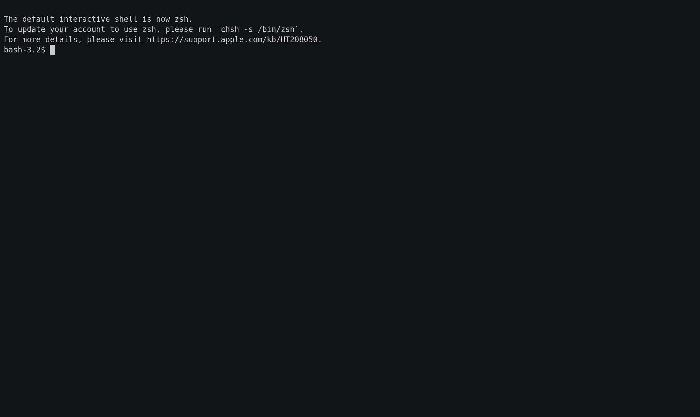

# kcs - kubectl Cheatsheet CLI

Command-line tool collects set of example usages of kubectl

### Features

- Searchable
- Easy to read
- Verbose mode for description

### Installation

Requirement:
- Golang 1.13

```
git clone git@github.com:PumpkinSeed/kcs.git && cd kcs 
make install
```

### Usage

```
$ kcs help
NAME:
   kcs - Searchable kubectl cheatsheet CLI tool

COMMANDS:
   help, h  Shows a list of commands or help for one command

GLOBAL OPTIONS:
   --verbose, -v             Set verbose mode (default: false)
   --search value, -s value  Set search query
   --category value          Set a certain category
   --command value           Set a certain command
   --help, -h                show help (default: false)
```

```
$ kcs # prints everything out
$ kcs -v # add description to the commands
$ kcs --category config # prints out the config realted commands
$ kcs --category config --command view # prints out the config's view command
$ kcs --search services # search in the whole content and prints everything satisfied the search term
```

**Usage**



**Usage of search**


